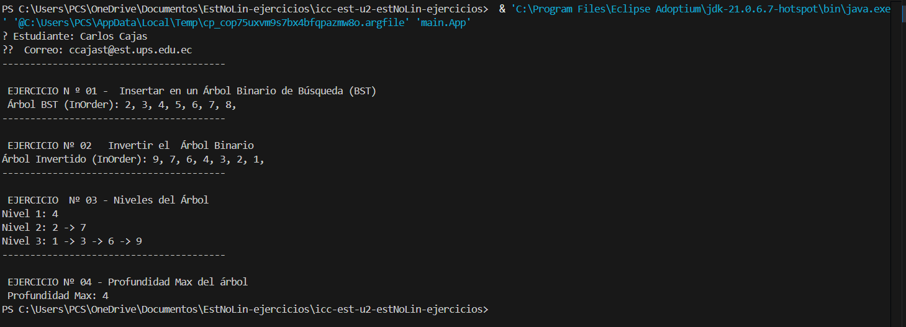

# 🌳 Estructuras No Lineales – Ejercicios con Árboles

EEste trabajo aplica estructuras no lineales, específicamente árboles binarios, para resolver problemas de inserción, recorrido, inversión y análisis de profundidad, usando Java

---

## 👤 Estudiante

- **Nombre completo:** Carlos Andrés Cajas Tapia  
- **Correo institucional:** carlos.cajas@est.ups.edu.ec

---

## 🎯 Objetivo de la práctica

Aplicar estructuras de datos **no lineales** como los **árboles binarios** en la solución de problemas prácticos, desarrollando habilidades para insertar nodos, invertir árboles, recorrer niveles y calcular profundidad máxima. Además, reforzar la modularidad y el uso de clases en Java con buenas prácticas de programación.

---

## 📁 Estructura del proyecto

```
src/
├── main/
│   ├── App.java
│   ├── Ejercicio_01_insert/
│   │   └── InsertBST.java
│   ├── Ejercicio_02_invert/
│   │   └── InvertBinaryTree.java
│   ├── Ejercicio_03_listLeves/
│   │   └── ListLevels.java
│   ├── Ejercicio_04_depth/
│   │   └── Depth.java
│   └── Materia/
│       └── Models/
│           └── Node.java
├── student.env
└── README.md
```

## 🧪 Explicación de Ejercicios y Métodos

### ✅ Ejercicio 01: Insertar en un Árbol Binario de Búsqueda (BST)

**Archivo:** `InsertBST.java`  
**Clase:** `InsertBST`  
**Método implementado:** 


public Node insert(Node padre, int value)

🔍 Descripción:
Este método inserta un nodo con un valor en un Árbol Binario de Búsqueda (BST). Si el árbol está vacío, crea un nuevo nodo. Si el valor es menor, se va al subárbol izquierdo; si es mayor, al derecho. Así se mantiene el orden BST.

🧪 Ejemplo de entrada:

int[] valores = {5, 3, 7, 2, 4, 6, 8};

📤 Resultado esperado (inorden):

2, 3, 4, 5, 6, 7, 8

### 🔄 Ejercicio 02: Invertir un Árbol Binario
### Archivo: InvertBinaryTree.java
### Clase: InvertBinaryTree
### Método implementado:


public Node invertTree(Node node)

🔍 Descripción:

Este método invierte (refleja horizontalmente) un árbol binario. Intercambia recursivamente los nodos izquierdo y derecho de cada subárbol, hasta que todo el árbol queda invertido como si fuera un espejo.

### 🧪 Árbol original:
        4
      2   7
    1   3  6  9


### 📤 Árbol invertido:

        4
      7   2
    9   6  3  1


 
### 🌿 Ejercicio 03: Listar niveles en listas enlazadas
Archivo: ListLevels.java
Clase: ListLevels
Método implementado:


### public List<List<Node>> listLevels(Node root)
🔍 Descripción:
Este método recorre un árbol por niveles (BFS) usando una cola (Queue). Agrupa los nodos de cada nivel en una lista, y devuelve una lista general que contiene todas las listas de niveles.

### 🧪 Árbol de ejemplo:
    
       4
      2 7
     1 3 6 9
### 📤 Salida esperada:


Nivel 1: 4  
Nivel 2: 2 -> 7  
Nivel 3: 1 -> 3 -> 6 -> 9

### 📏 Ejercicio 04: Calcular profundidad máxima
Archivo: Depth.java
Clase: Depth
Método implementado:

### public int maxDepth(Node node)
🔍 Descripción:
Este método calcula la profundidad máxima de un árbol binario (camino más largo desde la raíz hasta una hoja). Utiliza recursividad para obtener la altura de cada subárbol y devuelve el valor máximo + 1.

### 🧪 Árbol de ejemplo:


         4
       2   7
     1 3
    8
### 📤 Salida esperada:


🔢 Profundidad máxima: 4

--

## 🛠️ Cómo ejecutar el proyecto

1. 📌 Completa tus datos en el archivo `student.env`:
   ```env
   STUDENT_NAME=Carlos Andrés Cajas Tapia
   STUDENT_EMAIL=carlos.cajas@est.ups.edu.ec
   ```

2. 🖥️ Ejecuta `App.java` desde tu IDE o terminal:
   ```bash
   javac src/main/App.java
   java -cp src/main main.App
   ```

3. 📤 Se imprimirá el resultado de cada ejercicio uno por uno.

---

## ✅ Validación final y entrega

- ✅ Archivo `student.env` lleno.
- ✅ Todos los métodos implementados con nombres correctos.
- ✅ Estructura de carpetas por ejercicio.
- ✅ Archivo `README.md` con explicación completa.
- ✅ Commit con mensaje:
  ```bash
  git commit -m "Estructuras No Lineales – Ejercicios Árboles"
  ```
- ✅ Subir la URL del repositorio al AVAC.

---
## Resultados de Ejecución



---

## 🧠 Conclusiones

- Se comprendió el funcionamiento de estructuras no lineales como los **árboles binarios**.
- Se aplicaron recorridos **inorden** y **por niveles**, así como operaciones recursivas complejas como inversión y profundidad.
- Se reforzó la lógica algorítmica y la organización modular en Java.

---

## 📌 Recomendaciones

- Revisar que el `App.java` compile correctamente y se impriman todos los resultados.
- Comentar adecuadamente cada clase y método.
- Seguir la nomenclatura exigida para evitar pérdida de puntos.
- Validar el `student.env` antes de hacer `push`.

---

## 👨‍🏫 Docente

**Ing. Pablo Torres**  
Repositorio base:  
🔗 [https://github.com/PabloT18/icc-est-u2-estNoLin-ejercicios](https://github.com/PabloT18/icc-est-u2-estNoLin-ejercicios)


